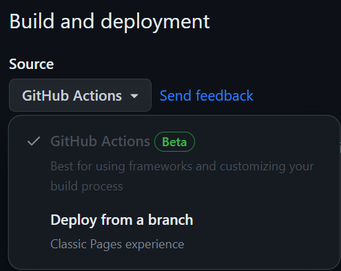

# React Project Template With Routing

This project was created with
[Vite](https://vitejs.dev/). To get
acquainted and configure additional features
[refer to guide](https://vitejs.dev/guide/).

## Getting Started

To run this React Project Template on your local machine, follow these steps:

### Clone the Repository

```bash

git clone https://github.com/KHARKIVSKA-KURKUMA/react-vite-project-template-js.git

```

Or just tap the `«Use this template»` button and choose
`«Create a new repository»` option

### Install Dependencies

```bash

npm install

```

### Run the Application

```bash
npm start

```

<a id="deploy"></a>

## Deploy + Routing

Change `<YOUR_REPO_NAME>` to your repo name in `vite.config.js`

```jsx
if (command !== "serve") {
  config.base = "/<YOUR_REPO_NAME>/";
}
```

and in `App.jsx` file

```jsx
 <BrowserRouter
        basename={
          import.meta.env.DEV ? "/" : "/<YOUR_REPO_NAME>/"
        }
      >
```

The production version of the project will automatically be built, and
deployed to GitHub Pages every time the `main` branch
is updated.

Next, you need to go to the settings of the GitHub repository (`Settings` >
`Pages`) and set the distribution of the production version of files with GitHub Action, if this was not done automatically. You can see it on the image below.



### Deployment status

The deployment status of the latest commit is displayed with an icon next to its
ID.

-  - the project is being built and deployed.
-  - deployment completed successfully.
-  - an error occurred during linting, build, or deployment.

More detailed information about the status can be viewed by clicking on the
icon and in the drop-down window, follow the link `Details`.

### Live page

The page requires a couple of minutes to load, the live page can be viewed at the
address `https://<YOUR_GITHUB_USERNAME>.github.io/<REPO_NAME>/`. For example, here is a link
to a live version for this repository

[https://kharkivska-kurkuma.github.io/react-vite-project-template-js/](https://kharkivska-kurkuma.github.io/react-vite-project-template-js/).

If a blank page opens, make sure there are no errors in the `Console` tab
related to incorrect paths to the files of the project (**404**). If you have such errors double check [Deploy Section](#deploy)
