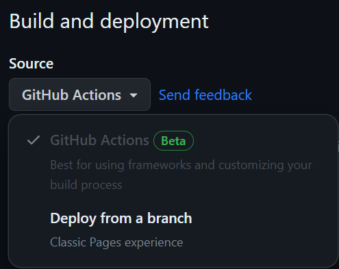

# React Project Template

Цей проєкт був зібраний за допомогою
[Vite](https://vitejs.dev/). Ознайомитись та налаштувати додатковий функціонал
[перейти до документації](https://vitejs.dev/guide/).

## Почати

Для запуску цього React Project Template на вашому локальному комп'ютері, виконайте ці дії:

### Склонуйте цей репозиторій

```bash

git clone https://github.com/KHARKIVSKA-KURKUMA/react-vite-project-template-js.git

```

Або натисніть `«Use this template»` кнопку і виберіть
`«Create a new repository»`

### Встановіть залежності

```bash

npm install

```

### Запустіть додаток

```bash
npm start

```

## Розгортання (Deploy)

Продакшн-версія проекту буде автоматично створена, створена та розгорнется на GitHub page кожного разу, коли гілка `main`
оновлюється.

Далі потрібно зайти в налаштування репозиторію GitHub (`Settings` >
`Pages`) і встановіть розповсюдження робочої версії файлів за допомогою GitHub Action, якщо це не було зроблено автоматично. Ви можете побачити це на зображенні нижче.



### Статус Розгортання

Статус розгортання останнього коміту відображається разом із іконкою

- **Жовтий колір** - проект будується і розгортається.
- **Зелений колір** - розгортання завершено успішно.
- **Червоний колір** - сталася помилка під час збірки або розгортання.

Більш детальну інформацію про статус можна переглянути, натиснувши на
і у випадному вікні перейдіть за посиланням `Details`.

### Жива сторінка

Через деякий час, як правило, пару хвилин, сторінку в прямому ефірі можна буде переглянути за
адресою, `https://<YOUR_GITHUB_USERNAME>.github.io/<REPO_NAME>/`. Наприклад, ось посилання
до живої версії для цього репозиторію

[https://kharkivska-kurkuma.github.io/react-vite-project-template-js/](https://kharkivska-kurkuma.github.io/react-vite-project-template-js/).

Якщо відкривається порожня сторінка, переконайтеся, що на вкладці `Console` немає помилок
пов'язаних з неправильними шляхами до файлів CSS і JS проекту (**404**).
